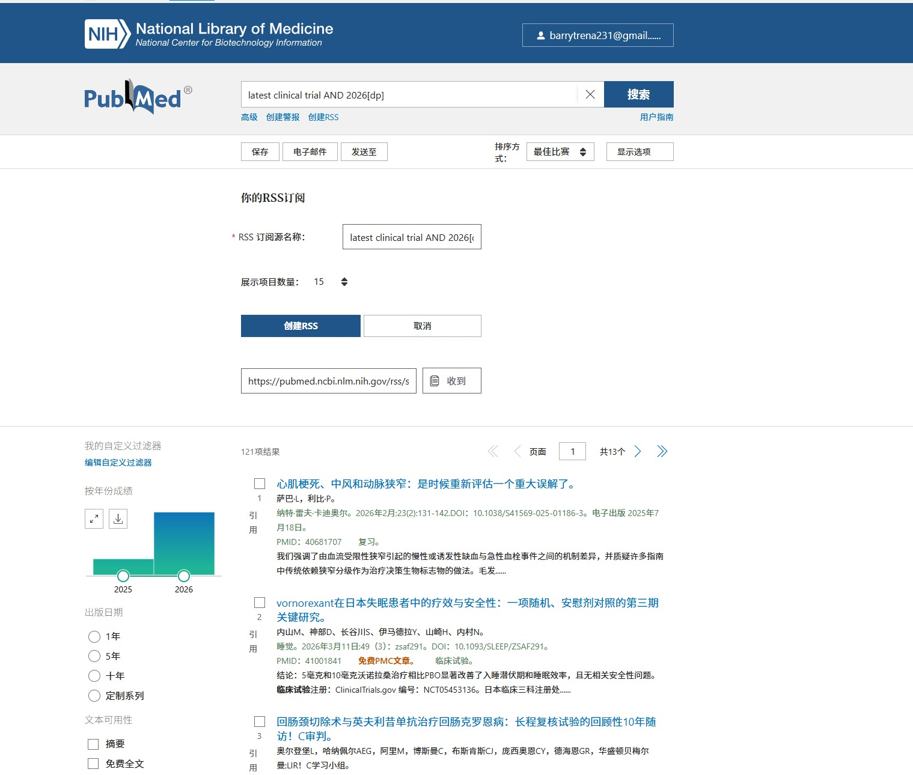
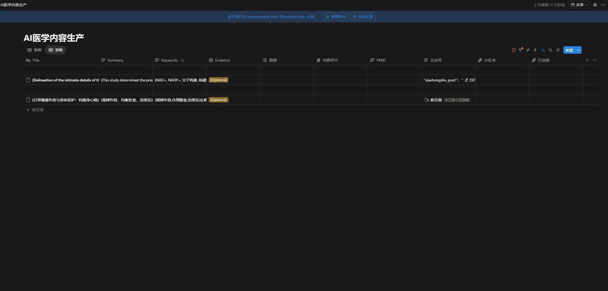

#医疗AI资讯自动化工作流（医疗AI工作流）
基于 Dify + Notion 的医学资讯自动化处理系统，将人工内容整理时间从数小时压缩至10分钟内。

---

## ✨ 项目亮点
- **效率提升 90%+**：单篇医学资讯的结构化处理，从人工2-3小时缩短至自动化10分钟内
- **全流程自动化**：从内容输入 → AI分析 → 结构化输出 → Notion自动归档，无需人工干预
- **多场景适配**：支持医学文章、指南、研究论文等多种类型内容处理
- **标准化输出**：统一生成标题、摘要、关键词、证据等级等结构化字段

---

## 🛠️ 技术栈
| 模块 | 工具/平台 | 用途 |
| :--- | :--- | :--- |
| 核心工作流 | Dify Studio | 可视化搭建自动化流程，管理AI节点与数据流转 |
| 大模型能力 | DeepSeek API | 医学内容理解、结构化提取与文本生成 |
数据存储Notion数据库API|结构化结果自动写入、归档与长期管理|
| 输出格式 | Markdown/JSON | 支持直接用于公众号、知识库等多平台二次发布 |

---

## 🚀 功能介绍
1.  **医学内容智能解析**
    - 自动识别文章核心信息，生成规范标题与精简摘要
    - 提取关键医学术语、诊疗要点、循证证据等级
    - 支持处理长文本内容，解决大模型截断问题
2.  **Notion 自动化归档**
    -自动将结构化结果写入指定 Notion 数据库
    - 支持生成富文本页面块，适配公众号/小红书排版需求
    - 自动关联标签、分类，方便后续检索与管理
3.  **多平台输出适配**
    - 一键生成适合公众号发布的科普文案
    - 生成精简的小红书/朋友圈分享文案
    - 支持导出Markdown、JSON格式文件

---

## 📋 使用步骤
1.  **导入工作流**
    -打开Dify平台，导入项目文件`medical-ai-workflow-dify.json`
2.  **配置环境**
    - 配置 DeepSeek API Key
    - 配置 Notion API 密钥与目标 Database ID
3.  **运行流程**
    - 输入医学文章链接或全文
    - 一键启动工作流，等待自动处理完成
4.  **查看结果**
    - 结构化数据已自动同步至 Notion
    - 可直接复制输出文案用于多平台发布

---

## 📂 项目文件说明 
 medical-ai-workflow/
├── README.md # 项目说明文档（当前文件）
├── medical-ai-workflow-dify.json # Dify 工作流导出文件
├── 使用指南.md # 详细配置与使用教程
└── screenshots/ # 项目截图目录
├── 工作流全貌.png
├── Notion 归档效果.png
└── 运行结果示例.png

---

## 📈 量化成果
- 单篇内容处理效率：从人工2小时 → 自动化10分钟，效率提升 **90%+**
- 支持批量处理多篇医学资讯，降低重复工作成本
- 标准化输出格式，减少人工二次整理的错误与偏差

---

## 💡 后续扩展方向
- 增加多语言翻译功能，支持外文医学文献处理
- 接入更多大模型，实现多模型结果对比校验
- 对接更多知识库平台，实现一键多平台同步发布

## 📸 项目效果展示
### 1. PubMed RSS 订阅配置

### 2. Notion 数据库自动归档效果

### 3. 完整运行示例

## 📄 简历参考话术
【项目经历】医疗AI资讯自动化工作流
- 独立搭建基于Dify的医学资讯自动化处理系统，实现文章结构化输出+Notion自动存储
- 将人工内容整理效率提升90%以上，单篇处理时间从2-3小时压缩至10分钟
- 项目已开源至GitHub：https://github.com/M0g1cY/medical-ai-workflow
- 支持医学文章智能解析、多平台内容一键生成（公众号/小红书）
